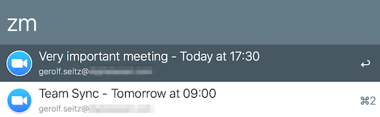
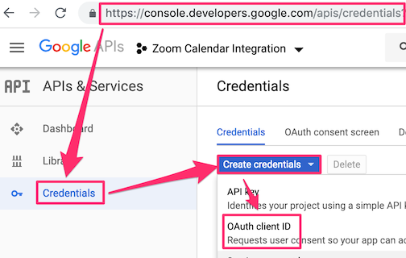
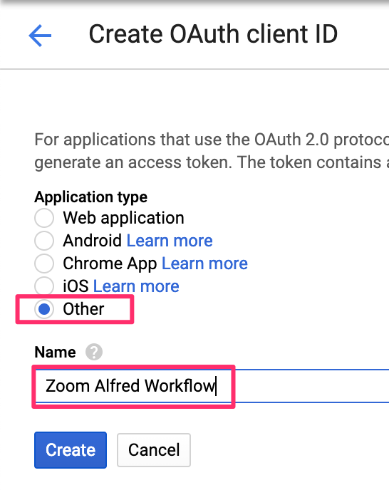
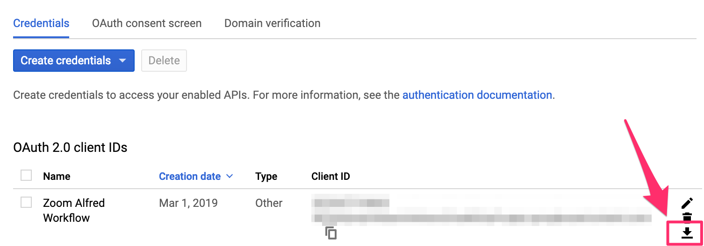
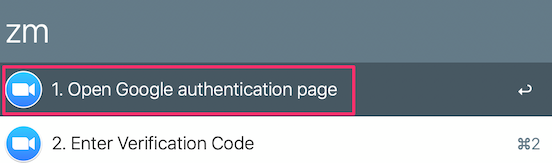
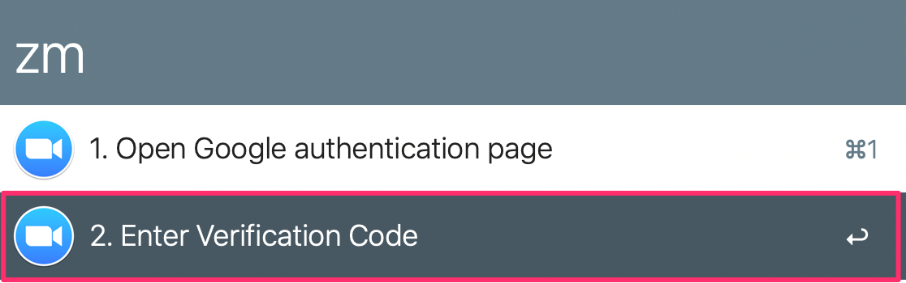
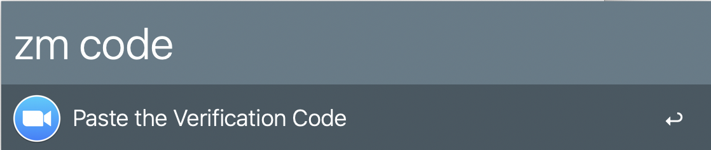
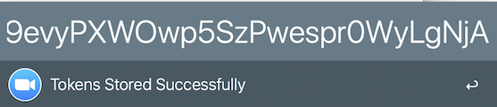

# Zoom Alfred Workflow

## TL;DR
Directly join [**Zoom**](https://www.zoom.us) meetings scheduled in **Google Calendar** via [**Alfred App**](https://www.alfredapp.com) *WITHOUT* having to go through a browser redirect.



The workflow lists all meetings in the next 48 hours with a zoom link in a Google Calendar event. The Zoom link is detected in these 3 event fields:
* the location field,
* the main calendar event text, or
* the zoom conferencing entry, created via the Zoom addon for Google Calendar.

Zoom links with a name rather than a zoom room number are currently not supported.

## What do I need?
1. Zoom app
1. Alfred + Powerpack
1. Google Account

## Installation and Setup
Download and install the workflow (either from source or from the releases page on github)

### Client Credentials
1. Create a new project in the [Google Developer Console](https://console.developers.google.com/apis/credentials)
1. Create new *OAuth Client ID* credentials for the project with application type *Other*.


1. Download the credentials file
    
1. Copy the credentials file to `~/.zoom-alfred-workflow/client_secret.json`


### OAuth
1. Invoke the Alfred workflow with `zm` and open the Google Authentication Page by actioning the first entry: 
1. Copy the verification code
1. Invoke the workflow again and action the second entry `2. Enter Verification Code`: 
1. Paste the verification code in the Alfred prompt after `zm code `: 
1. The final OAuth tokens will be saved at `~/.zoom-alfred-workflow/tokens`: 
1. Contratulations. You can now join your meetings without having to close annoying redirect-pages in the browser!


## How to build

```
git clone https://github.com/gseitz/zoom-alfred-workflow
cd zoom-alfred-workflow
# builds the rust binary and assembles the alfred workflow in dist/*.alfredworkflow
make dist
# builds the rust binary, assembles the alfred workflow, and automatically installs the workflow
make install
```

